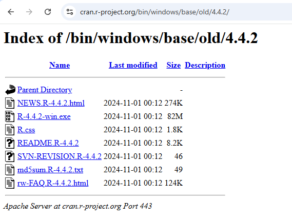
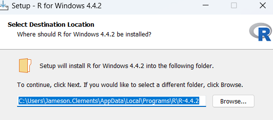
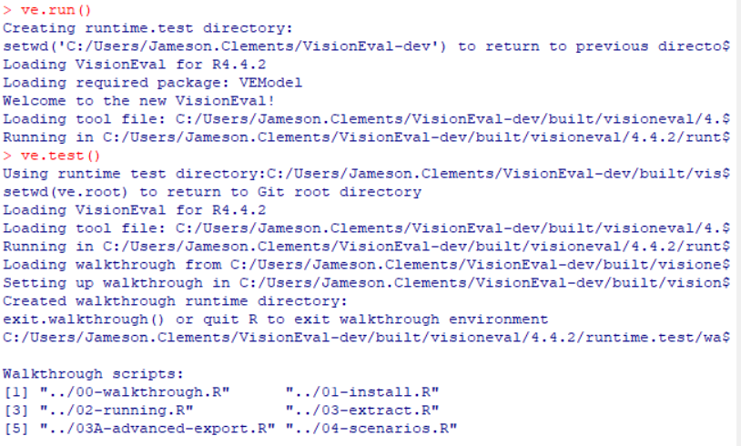
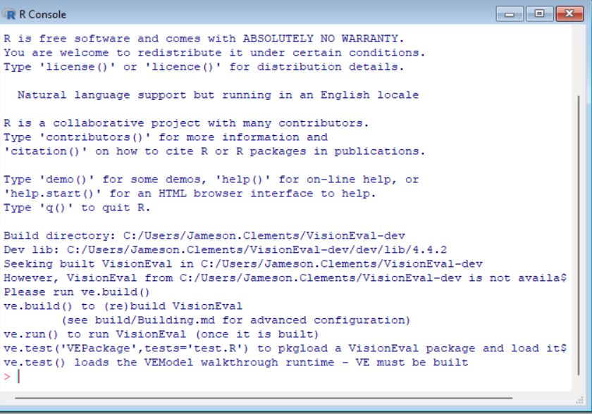
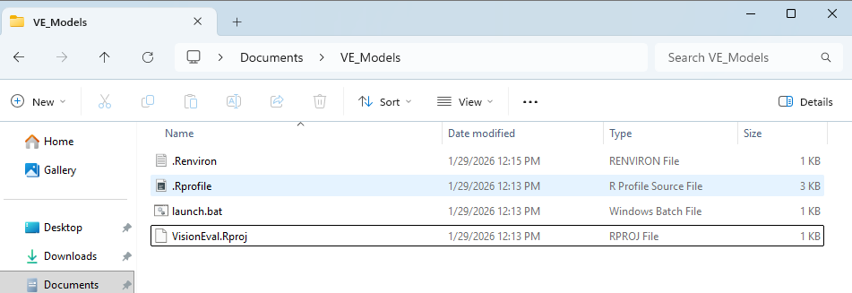

# Installing VisionEval on Windows for VE Region Builder

## Scope

This guide helps install VisionEval and configure the local runtime needed by
VE_RegionBuilder.

It does not replace `README.md`. After completing this guide, return to
`README.md` to prepare inputs, assemble statewide inputs, build a region, and
run generated models with the `.cmd` wrappers.

The recommended path is an end-user pre-built VisionEval installation.

## 1. Install R 4.4.2

Install the Windows build of R 4.4.2 from CRAN:

https://cran.r-project.org/bin/windows/base/old/4.4.2/

The R version must match the VisionEval runtime you install. For the current
pre-built VisionEval workflow, use R 4.4.2.

VE_RegionBuilder later needs the matching `Rscript.exe` path so its `.cmd`
wrappers can run VisionEval with the same R version.





## 2. Install the VisionEval Pre-Built Release

Open RGui using R 4.4.2.

In the R console, run:

```r
source(ve.url <- "https://visioneval.github.io/assets/install/VE4-install.R")
```

When prompted, choose the pre-built release option.

Choose a `VE_HOME` location. The installer may suggest a default location under
Documents, but a simple dedicated folder is usually easier to maintain.
`VE_HOME` should be a folder that contains `VisionEval.R`; it should not be the
`VisionEval.R` file itself.

After installation, the VisionEval runtime folder should contain `VisionEval.R`
and supporting runtime files:



## 3. Choose VE_RUNTIME

`VE_HOME` is the installed VisionEval runtime folder. It contains the
VisionEval startup file, packages, and supporting runtime files.

`VE_RUNTIME` is the folder VisionEval uses as the working runtime area for
models.

For normal VisionEval use, `VE_RUNTIME` may point to a separate models folder.
For VE Region Builder, `configs/local_runtime.yml` can set `ve_runtime` to
`outputs/generated_models` so generated regional models are visible to
`openModel()`.

Keep generated models separate from the base VisionEval installation.
VE_RegionBuilder creates generated region models under:

```text
outputs/generated_models/
```

Using a separate runtime location keeps the installed VisionEval files stable
and lets VE_RegionBuilder manage generated model outputs in the repository
workspace.

An example standalone VisionEval runtime/model workspace may look like this:



## 4. Verify `.Renviron`

The VisionEval installer should write `VE_HOME` and `VE_RUNTIME` to your user
`.Renviron` file.

Use placeholder paths like these when checking the file:

```text
VE_HOME=C:/Path/To/VisionEval
VE_RUNTIME=C:/Path/To/Runtime
```

`VE_HOME` must point to the folder containing `VisionEval.R`, not to
`VisionEval.R` itself.



## 5. Verify the VisionEval Installation

Launch VisionEval using the installed `launch.bat` or the runtime launcher
created by the installer.

In RGui, confirm that VisionEval functions such as these are available:

```r
print(exists("openModel"))
print(exists("installModel"))
```

Both checks should return `TRUE`. If VisionEval prints function definitions
when you type `openModel` or `installModel` directly, that is also fine, but the
boolean check is clearer.

Keep this check minimal; the VE_RegionBuilder runtime check below is the
important test for this project.

## 6. Find the Matching `Rscript.exe`

Open PowerShell and search common R install locations:

```powershell
Get-ChildItem "$env:LOCALAPPDATA\Programs\R" -Directory
Get-ChildItem "$env:LOCALAPPDATA\Programs\R" -Recurse -Filter "Rscript.exe" -ErrorAction SilentlyContinue |
  Select-Object FullName
Get-ChildItem "C:/Program Files/R" -Recurse -Filter "Rscript.exe" -ErrorAction SilentlyContinue |
  Select-Object FullName
```

For a VisionEval 4.4.2 installation, pick the `R-4.4.2` `Rscript.exe` path.

## 7. Connect VisionEval to VE_RegionBuilder

From PowerShell, set `VE_RSCRIPT` for the current session:

```powershell
$env:VE_RSCRIPT = "$env:LOCALAPPDATA\Programs\R\R-4.4.2\bin\Rscript.exe"
```

Some R installations put `Rscript.exe` under `bin\x64`:

```powershell
$env:VE_RSCRIPT = "$env:LOCALAPPDATA\Programs\R\R-4.4.2\bin\x64\Rscript.exe"
```

Then return to the VE_RegionBuilder repo root and configure:

```powershell
Copy-Item configs/local_runtime.example.yml configs/local_runtime.yml
```

Edit `configs/local_runtime.yml` so `ve_home` points to the folder containing
`VisionEval.R` and `ve_runtime` points to the generated models folder:

```yaml
ve_home: "C:/Path/To/Folder/Containing/VisionEval.R"
ve_runtime: "outputs/generated_models"

# Optional. PowerShell wrappers can use this path to launch the matching Rscript.
rscript: "C:/Path/To/R-4.4.2/bin/Rscript.exe"
```

Use forward slashes in YAML paths.

Run the runtime check from the VE_RegionBuilder repo root:

```cmd
scripts\check_visioneval_runtime.cmd
```

The `.cmd` wrappers are the recommended Windows path for VE_RegionBuilder.
They avoid common PowerShell `.ps1` execution-policy blocks and use
`VE_RSCRIPT` when it is set.

After the runtime check passes, return to `README.md` for the standard workflow:
prepare inputs, assemble statewide inputs, build a region, and run the region
model with `scripts\run_region_model.cmd`.

## Troubleshooting

`Incorrect R version for this VisionEval installation`

Meaning: `VE_RSCRIPT` points to the wrong R version. Find the R 4.4.2
`Rscript.exe` path and set `VE_RSCRIPT` again.

`VisionEval.R not found`

Meaning: `ve_home` points to the wrong location. Set `ve_home` to the folder
containing `VisionEval.R`, not to the file itself.

PowerShell `.ps1` blocked

Use the `.cmd` wrappers as the recommended path:

```cmd
scripts\check_visioneval_runtime.cmd
scripts\run_region_model.cmd my_region
```

## Optional Appendix: Developer Build from VisionEval-dev

This path is only for users who need to build VisionEval from source. Most
VE_RegionBuilder users should use the pre-built release above.

Install Rtools44 and Git.

Clone `VisionEval-dev` into a separate source folder.

Configure the VisionEval `launch.bat` for the local R 4.4.2 `R_HOME` and the
Rtools44 path.

Start VisionEval from the configured launcher and run:

```r
ve.build()
```

After the build succeeds, create a production runtime and configure
VE_RegionBuilder `ve_home`, `ve_runtime`, and `VE_RSCRIPT` to match that
runtime.

Generated VE_RegionBuilder models should still be written under
`outputs/generated_models/`, not inside the base VisionEval source or template
model folders.